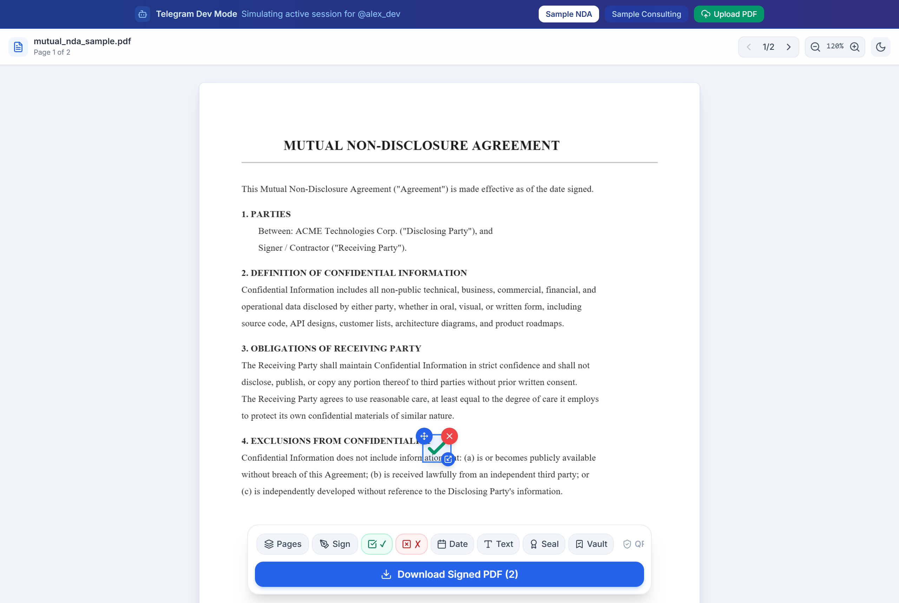
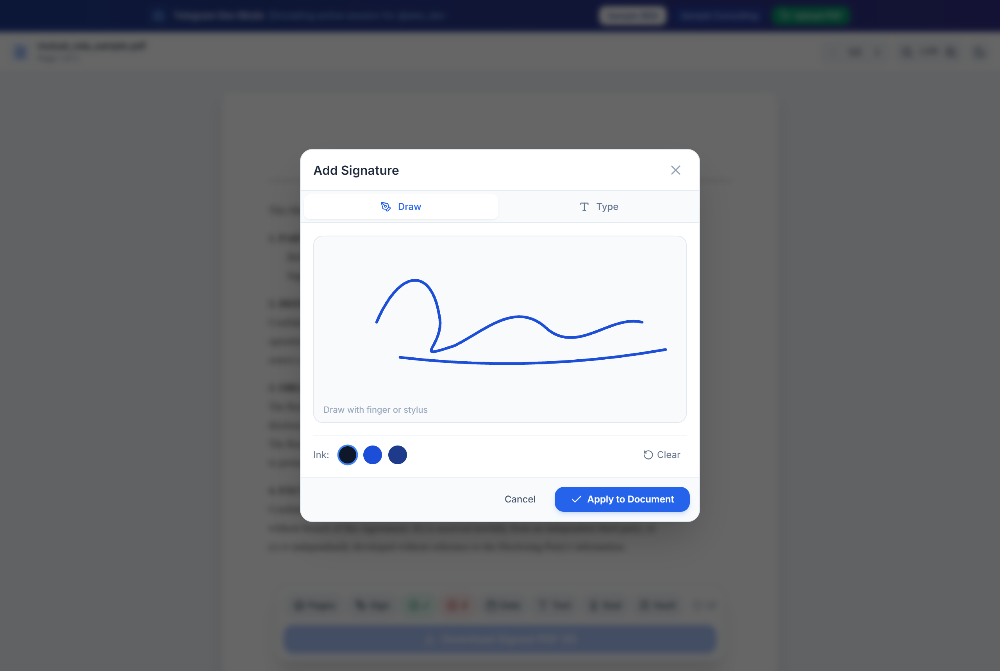
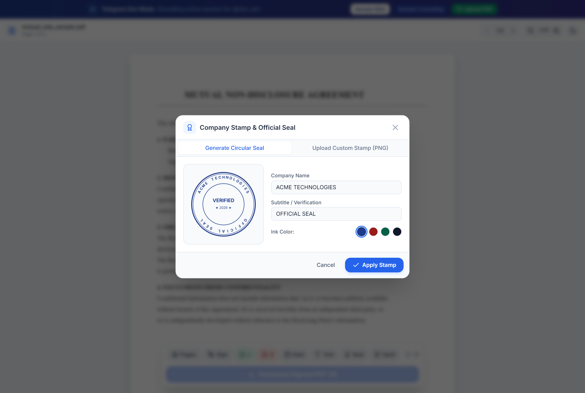
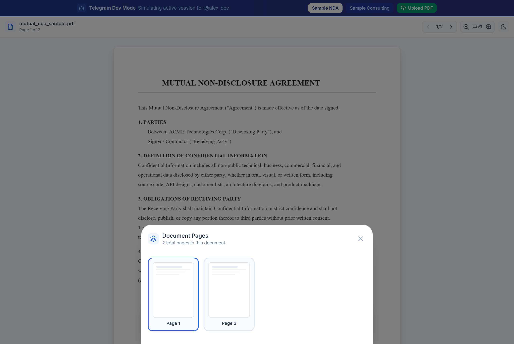
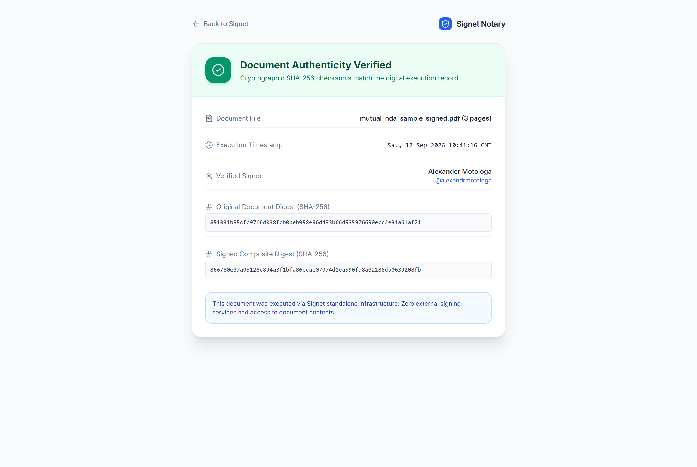
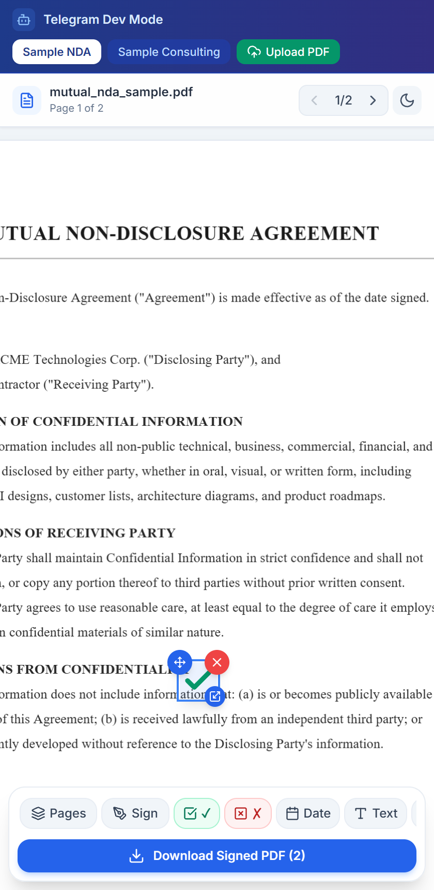

<p align="center">
  
</p>

<h1 align="center">Signet</h1>

<p align="center">
  <strong>Self-contained PDF signing and document execution suite built as a native Telegram Mini App.</strong><br />
  Vector stamping, cryptographic notarization, handwriting synthesis, and zero third-party cloud dependencies.
</p>

<p align="center">
  <a href="#interface-preview">Interface Preview</a> •
  <a href="#key-capabilities">Key Capabilities</a> •
  <a href="#architecture">Architecture</a> •
  <a href="#quick-start">Quick Start</a> •
  <a href="#cryptographic-verification">Verification</a> •
  <a href="#license">License</a>
</p>

---

Signet gives individuals and teams a complete legal document signing environment directly inside Telegram. It eliminates reliance on external SaaS signing vendors such as DocuSign or Adobe Sign. 

PDFs sent to the Telegram bot open instantly in a fluid canvas editor where signers can draw signatures, generate handwriting, place dates, apply official corporate seals, check boxes, and append tamper-evident cryptographic audit certificates.

---

## Interface Preview

### Desktop & Tablet Signing Workbench
Full-page vector document viewer with bottom glass action dock, live annotation counter, and interactive draggable badges.

<p align="center">
  
</p>

<br />

### Core Signing Tools

| Smooth Ink & Handwriting Engine | Official Company Stamp Generator |
| :---: | :---: |
|  |  |
| *Dual-mode touch canvas with Bezier curve smoothing and Caveat handwriting font synthesis.* | *Procedural circular corporate seal generator with custom authority text and ink presets.* |

| Multi-Page Navigation Drawer | Cryptographic Notarization Portal |
| :---: | :---: |
|  |  |
| *Multi-page visual inspector with active page jumping and placement indicators.* | *Public verification route displaying SHA-256 digests, signer identities, and execution proofs.* |

<br />

### Responsive Telegram Mini App Mode
Optimized touch experience built specifically for Telegram's mobile webview, complete with safe-area insets, theme synchronization, and haptic feedback.

<p align="center">
  
</p>

---

## Key Capabilities

- **Zero third-party vendor dependencies**: Operates without external SaaS signing platforms, metered API credits, or third-party tracking.
- **Pure JavaScript PDF pipeline**: Built on `pdf-lib` and `pdfjs-dist` without requiring native headless Chromium browsers, Poppler, or C++ binary bindings.
- **Zero domain requirement**: The Telegram bot communicates via long polling. Local testing runs directly in your browser with a mock Telegram container without needing ngrok or public HTTPS tunnels.
- **Exact coordinate mapping**: Converts CSS canvas coordinates to standard 72 DPI PDF points using bottom-left origins across arbitrary zooms and viewport orientations.
- **Dual-mode signature creation**: Sign by drawing smooth vector strokes with a finger or stylus, or generate cursive handwriting signatures.
- **Form completion overlays**: One-tap date stamps, checkmarks (✓), crossmarks (✗), custom text badges (signer title, company name, tax ID), and official circular corporate seals.
- **Signature vault**: Saves your primary signature, initials, title, and seals in client storage for one-click re-use.
- **Pinch-zoom & pan gestures**: Multi-touch pinch-to-zoom and two-finger panning for examining contract small print on mobile devices.
- **Multi-page thumbnail drawer**: Overview of all document pages with placement count indicators for quick navigation.
- **Dynamic QR audit certificate**: Appends a formal execution summary page to the signed PDF containing a scannable QR code linking to `/verify/:hash`.
- **Collaborative multi-party signing**: Initiate multi-signer flows in Telegram chats using `/sign_with @username` with sequential progression and dual-delivery upon completion.
- **Ephemeral storage security**: Temporary document payloads automatically expire and purge from disk storage after 60 minutes.
- **Bundled test contracts**: Includes pre-rendered Non-Disclosure Agreements and Consulting Agreements for instant testing.

---

## Architecture

Signet bundles a fast backend service and a modular web application into a unified deployment:

1. **Backend Service (`server/`)**: Written in TypeScript with Node.js and Fastify. It hosts the long polling grammY bot, manages ephemeral storage, runs the coordinate transformer, and bakes vector stamps and audit sheets into PDFs using `pdf-lib`.
2. **Mini App Frontend (`web/`)**: Written in React 19 with Vite and Tailwind CSS. It leverages `pdfjs-dist` to render vector pages onto HTML5 canvas surfaces and uses `signature_pad` for touch input.

```
                  +-----------------------------------+
                  |         Telegram Client           |
                  |  (Sends PDF / Opens Mini App)     |
                  +-----------------+-----------------+
                                    |
                    Telegram Bot API / Long Polling
                                    |
                                    v
+-------------------------------------------------------------+
|                         Signet Host                         |
|                                                             |
|  +-------------------------------------------------------+  |
|  |             Fastify HTTP & Telegram Bot               |  |
|  |                                                       |  |
|  |  * Long Polling Bot (/start, document interceptor)    |  |
|  |  * REST API (/api/upload, /api/sign, /api/document)   |  |
|  |  * Ephemeral Store (auto cleanup after 60 minutes)    |  |
|  |  * Coordinate Transformer (Canvas to PDF points)      |  |
|  |  * PDF Stamping Engine (pdf-lib vector embedding)     |  |
|  |  * Audit Trail & SHA-256 Hash Verification            |  |
|  +---------------------------+---------------------------+  |
|                              ^                              |
|                              | REST / JSON + Base64         |
|                              v                              |
|  +-------------------------------------------------------+  |
|  |             Telegram Mini App (React + Vite)          |  |
|  |                                                       |  |
|  |  * PDF Canvas Renderer (pdfjs-dist)                   |  |
|  |  * Touch Signature Pad (Bezier smoothing)             |  |
|  |  * Draggable & Resizable Stamping Overlays            |  |
|  |  * In-Browser Dev Mock Harness                        |  |
|  +-------------------------------------------------------+  |
+-------------------------------------------------------------+
```

---

## Quick Start

### Prerequisites

- Node.js 20 or higher
- npm 10 or higher
- Optional: Docker and Docker Compose

### 1. Clone and install dependencies

```bash
git clone https://github.com/alexandrmotologa/signet.git
cd signet
npm install --prefix server
npm install --prefix web
```

### 2. Configure environment variables

Copy the example environment template:

```bash
cp .env.example .env
```

Supply your Telegram bot token from `@BotFather` (or leave blank to run in mock development mode):

```ini
TELEGRAM_BOT_TOKEN=your_token_from_botfather
PORT=8080
HOST=0.0.0.0
WEB_APP_URL=http://localhost:8080
STORAGE_DIR=./storage
```

### 3. Run development servers

To start the backend with automatic reloads:

```bash
npm run dev:server
```

To start the frontend Vite development server:

```bash
npm run dev:web
```

Visit `http://localhost:5173` to test the full Mini App experience inside the built-in Telegram mock frame.

### 4. Build and run in production

```bash
npm run build
npm run start
```

Or deploy with Docker:

```bash
docker compose up --build
```

The unified service will listen on `http://localhost:8080`.

---

## Cryptographic Verification

Every signed PDF processed with an audit trail receives an unalterable SHA-256 fingerprint recorded in Signet's notary registry. 

Third parties can scan the QR code on the audit page or browse to:

```
http://localhost:8080/verify/<sha256-hash>
```

The verification portal confirms:
- Original document SHA-256 checksum
- Final signed composite SHA-256 checksum
- Exact execution timestamp (UTC)
- Verified Telegram signer identity and username
- Number of pages and embedded signature placements

---

## User Workflow

1. A user sends or forwards a PDF file to the Telegram bot.
2. The bot downloads the file, assigns an ephemeral document ID, and replies with an inline **Sign & Fill Document** button.
3. The user taps the button to launch Signet inside Telegram.
4. The user views the contract, draws or types a signature, places dates or company stamps, and turns on the audit trail option.
5. The user taps **Save and Send to Telegram**.
6. The server bakes all vector elements into the PDF, appends the audit certificate, and the bot delivers the finalized PDF directly into the chat.

---

## Project Structure

```
signet/
├── docs/
│   ├── images/              # Logo and UI screenshots
│   ├── API.md               # REST API documentation
│   ├── ARCHITECTURE.md      # Engineering architecture details
│   └── TELEGRAM_SETUP.md    # Telegram BotFather configuration guide
├── server/
│   ├── src/
│   │   ├── bot/             # grammY Telegram bot handler
│   │   ├── pdf/             # Coordinate mapping, samples, and stamping
│   │   ├── routes/          # Fastify API endpoints
│   │   ├── security/        # Telegram initData HMAC-SHA256 validator
│   │   └── storage/         # Ephemeral disk store and auto-cleanup
│   └── test/                # Vitest automated test suite
├── web/
│   ├── src/
│   │   ├── components/      # React UI components and modals
│   │   ├── hooks/           # Telegram WebApp and PDF.js hooks
│   │   └── styles/          # Tailwind design tokens
└── scripts/                 # Procedural logo and screenshot utilities
```

---

## Contributing

Please review [CONTRIBUTING.md](CONTRIBUTING.md) for contribution guidelines, project setup, and pull request workflows.

## License

MIT License. See [LICENSE](LICENSE) for details.